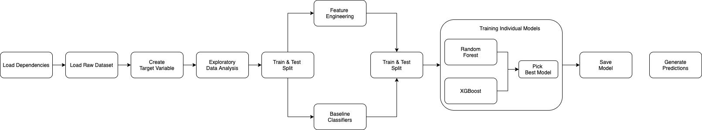
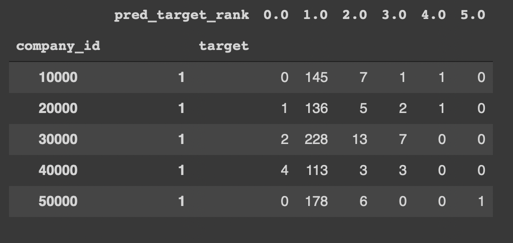
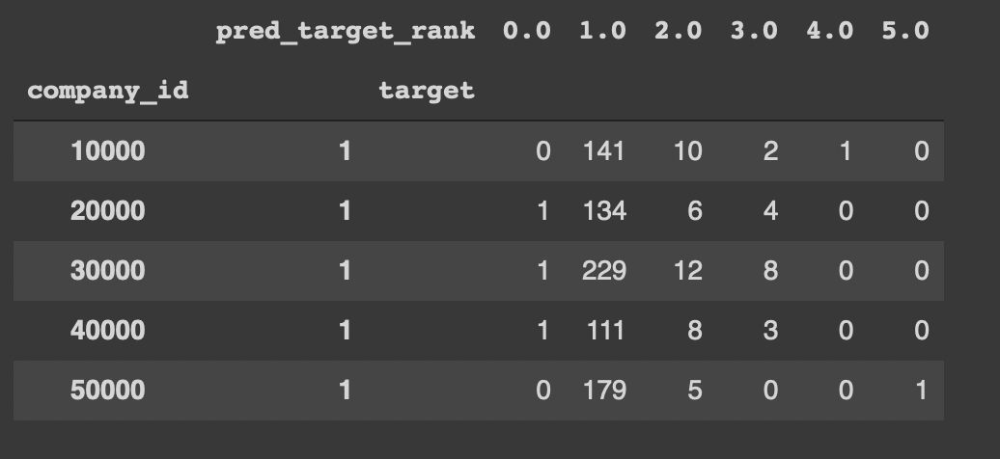

### Tide Transaction Receipt Matching

The overall flow of the analysis is summerized with the help of a flow chart

### Where to find

- <b>/model :</b> XGBoost saved model
- <b>/data  :</b>
    - <b>raw_data/ :</b> original dataset
    - <b>interim_data/ :</b> processed dataset with added variable 'target'
- <b>/doc   :</b>
    - <b>report  :</b> a quick report that summarizes the whole analysis

### Quick Model Metrics

As, we find our data is highly imbalanced, we focussed on ROC AUC metrics for each model. Individual models metrics are

| Model | Test data AUC |
|---------------|---------|
| Random Forest | 0.908558
| XGBoost       | 0.964785|

### Quick Business Metrics

As, data is highly imbalance, our area of focus is high Recall. We build a final contingency table for each model to analyse the buckting of the ranks.

| Random Forest | XGBoost |
|---------------|---------|
|  | 

By compairing the contigency table we can see XGBoost performs well in bucketing majority to the lower rank of 1.

### Areas of Improvement

- Feature Enginerring
- Feature Selection

Can put more light on Feature Engineering by creating more important features and Feature Selection to find the important subset of features related to different models.

