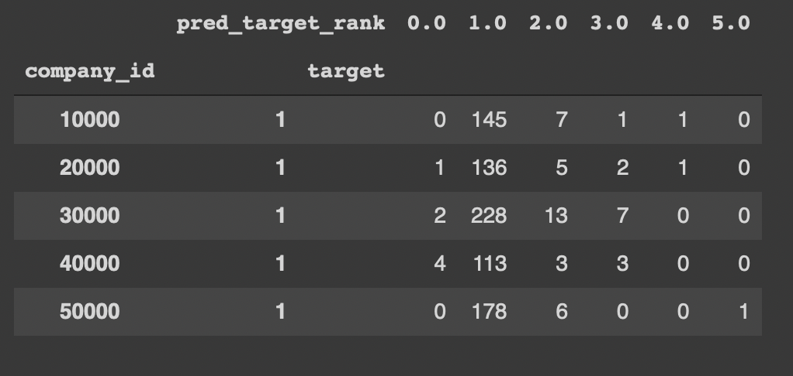
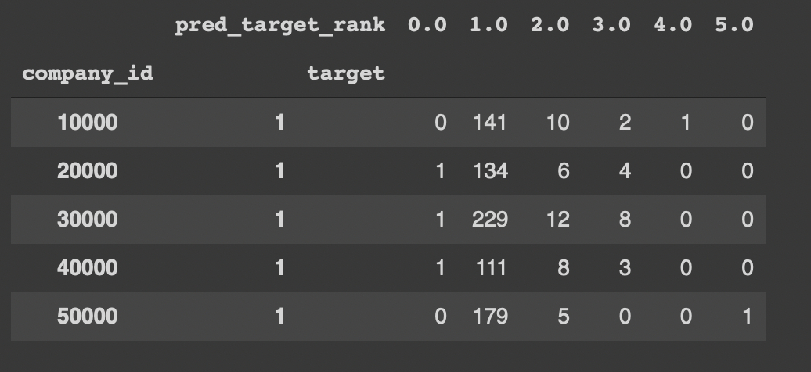

## Tide Transaction Receipt Matching

### Machine Learning Based Approach

- Used a supervised learning algorithm to solve the problem
- Build a model that will learning from the data we have about matching features
- The model will assign the probability to each target variable
- Next, we sort the probability to assign rank 

### Final Model

We use XGBoost as our final model because it's good with highly imbalanced dataset.

### Evaluation Metrics

Given the nature of the problem, We focus on ROC AUC score as evaluation metric. Our main focus is on reducing the False Negative i.e. Higher Recall

### Visual Representation of Analysis


### Steps to the solution

We summarize the analysis in 12 major steps

- <b>Step 1 : Import Modules/Packages</b>

Load the important dependencies like -
- <b>Data Manipulation :</b> Pandas, Numpy
- <b>Model Building :</b> Fast ML, SKlearn
- <b>Data Visualization :</b> Matplotlib, Seaborn

After successful import

- <b>Step 2 : Define Constant</b>

Define contant variables used in the saving, loading, formatting the data.

- <b>Step 3 : Load the Raw Dataset</b>

Load the original dataset. And perform checks like Null values or dimension of the dataset

- <b>Step 4 : Create Target Variable</b>

A supervised machine learning approach needs features and labels/target. As our original dataset lacks target but we know the logic hence, we'll create the target variable using logic

```
if 'matched_transaction_id' == 'feature_transaction_id' then
    return 1
else
    return 0
```

where 
- 0 : Not Matched
- 1 : Matched

Now, we are end up with 2 labels. We can start with the supervised learning approach.

- <b>Step 5 : Exploratory Data Analysis</b>

We will perform EDA to understand the distribution of our data in depth. We find that our data is highly imbalanced. It will help us in defining the evaluation metrics and selecting the model.

- <b>Step 6 : Train, Validate & Test split</b>

Split the dataset into 
- Train : used for training the model
- Validate : used for validation
- Test : used for testing the evaluation metrics

Now, it will help us in compairing the metrics for train, validate or test dataset.

- <b>Step 7 : Baseline Classifier</b>

Run 24 baseline classifier to understand how our models perform without Feature Engineering and Selection. It will help us in setting up a supportive threshold for our future models.

<b>We find that boosting algorithm perform better that bagging algorithm. We take this as a hypothesis and try to Accept or Reject it in future steps.</b>

- <b>Step 8: Feature Engineering</b>

As we are limited in features, we'll perform Feature Engineering to create more features using two approaches -

- combination of 2 : we can create a new feature from the combination of 2 features
- combination of 3 : we can create a new feature from the combination of 3 features

<b>Note :</b> ReceiptIDs, FeatureTransactionIDs and MatchedTransactionIDs are actually group indicators in data, let us identify the receipt-transaction groups in data but dont actually provide additional information. And excluding CompanyId too, we'll be left with 10 features.

After performing Feature Engineering we move from 10 features to 175 features.

- <b>Step 9: Again perform Splitting</b>

This time we perform Train, Validate, and Test split on updated features dataset.

- <b>Step 10: Train Individual Models</b>

    - <b>Random Forest</b>
    We perform training on Random Forest (i.e. a bagging technique). And used Business and Model metrics as the evaluation criteria.

    We find our AUC on test dataset = 0.90
    
    And, while checking the performance of our target=1. We find as we move towards the higher rank the values decreases that's a good sign, as our end goal is to shift values in higher ranks to lower ranks.  

    

    Now, let's see if the boosting technique perform better than the bagging technique

    - <b>XGBoost</b>
    We perform training on XGBoost (i.e. a boosting technique). And used Business and Model metrics as the evaluation criteria.

    As, we know XGBoost perform really well for imbalanced data and it has too many hyperparameters which than optimize the model. It's a good choice for our solution.

    Since we have many parameters to optimize, we will use GridSearchCV(). We specify a bunch of potential values for the hyperparameters and GridSearchCV() tests all possible combinations of the parameters for us.

    After testing all possible combinations of the potential parameter values with Cross Validation, we find
        -   gamma = 0.25
        -   learn_rate = 0.1
        -   max_depth = 4
        -   reg_lambda = 10

    We find our AUC on test dataset = 0.96

    

    And, while checking the performance of our target=1. We find
        - Most of the time we have picked the right receipts in top 5 ranks
        - In maximum number of cases correctly matched receipts are in rank = 1 category
        - Very few goes beyond rank 2
        - This result is quite better than our random forest result

- <b>Step 11: Save the model</b>

We save the XGBoost model for future reference

- <b>Generate Prediction</b>
We'll use saved model for generating the predictions. The function take input varibales as

- input_data :  in a dataframe format
- max_rank   : maximum rank upto which you want to assign
- _threshold : a threshold to judge the cut-off of target label probabilities


